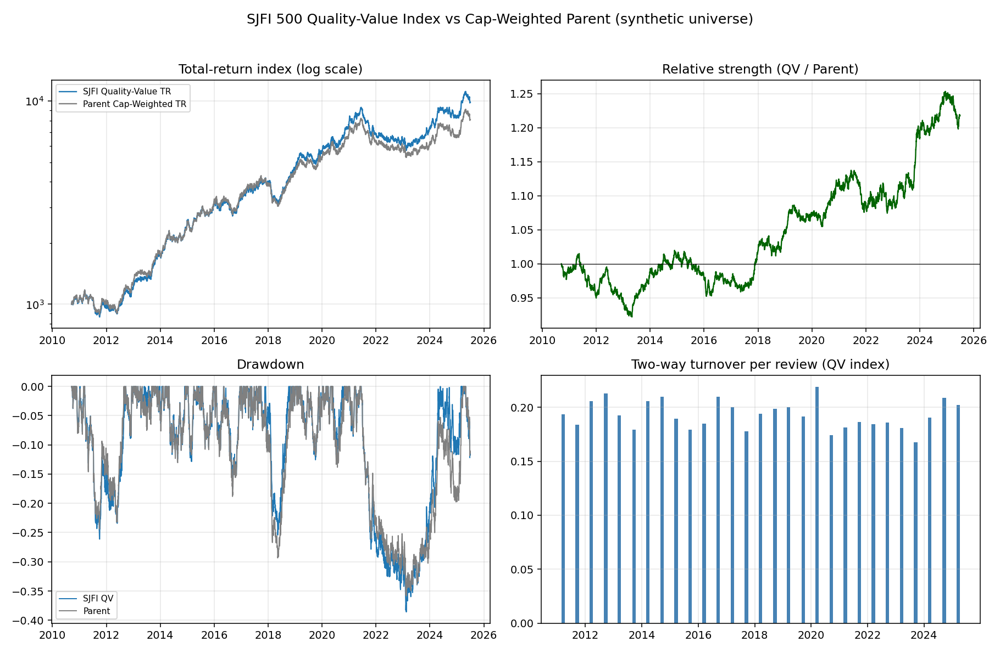

# SJFI 500 Quality-Value Factor Index

An equity factor index built the way an index provider builds one. I wrote the Ground Rules
document first, then built a divisor-based calculation engine that implements every rule in it,
then backtested the whole thing against a cap-weighted parent benchmark running on the same
engine.

Most factor projects I have seen are a strategy backtest with a rebalance loop in the middle. I
wanted to know what changes if you hold yourself to provider discipline instead. Point-in-time
data. An announcement calendar. A divisor that survives corporate actions. An audit trail for
every review, and a methodology document a client could replicate from without having to ask you
a single question.

Quite a lot changes, as it turns out.

**Start with the methodology:** [`outputs/SJFI_500_Ground_Rules_v1.0.docx`](outputs/SJFI_500_Ground_Rules_v1.0.docx).
Eligibility screens, factor scoring, the capping algorithm, the review calendar, corporate-action
treatment, divisor arithmetic. Appendix A maps every ground rule to the module and the unit test
that implements it.



## What makes this an index

| Provider discipline | Where it lives |
|---|---|
| Divisor-based daily calculation (PI + TR variants) | `engine.py`, Ground Rules §8 |
| Corporate actions: splits, dividends, deletions, IPOs | `engine.py`, Ground Rules §7 |
| Point-in-time fundamentals with publication lags | `universe.py::fundamentals_asof` |
| Semi-annual review calendar (cut-off, announcement, effective) | `calendar.py`, Ground Rules §6 |
| Eligibility screens with per-screen audit trail | `eligibility.py`, Ground Rules §3.2 |
| Iterative single-constituent capping with feasibility check | `weighting.py`, Ground Rules §5.2 |
| Benchmark computed on the identical engine | `strategies.py` |
| Survivorship-bias-free universe (12% delistings, 15% IPOs) | `synthetic.py` |

The benchmark row is the one I would defend hardest. The parent benchmark goes through the same
divisor code, the same corporate-action handling, the same eligible universe. So when the active
return comes out at +1.5%, none of it is two pieces of code doing arithmetic slightly differently
and me calling the gap alpha.

## Quickstart

```bash
pip install -r requirements.txt
python -m pytest tests/ -q        # 8 engine-invariant tests
python run_backtest.py            # full 2010-2025 backtest, ~30s
```

Outputs land in `outputs/`: summary stats, daily index levels, the per-review audit log, a
four-panel backtest report, and the active factor exposure chart.

If you would rather not install anything,
[`notebooks/SJFI_500_Backtest_Colab.ipynb`](notebooks/SJFI_500_Backtest_Colab.ipynb) clones this
repo and reproduces all of it in Colab in about a minute.

Regenerating the Ground Rules document is optional, since the built `.docx` is committed. If you
want to anyway, `npm install && npm run build:methodology`.

## Headline results (synthetic path, seed 4)

| | SJFI 500 QV (TR) | Parent CW (TR) |
|---|---|---|
| Ann. return | 16.7% | 15.2% |
| Ann. vol | 17.1% | 17.1% |
| Max drawdown | -38.6% | -35.9% |
| Active return / TE / IR | +1.5% / 3.3% / 0.46 | n/a |
| Avg review turnover (2-way) | 19.3% | 4.2% |
| Est. cost drag p.a. (15bp/unit) | 6bp | 1bp |

The active t-stat is 1.51 over fifteen years, which is consistent with the premium I embedded in
the data and nowhere near significant on its own. Turnover is the number I would watch in a live
version. 19.3% two-way at 15bp per unit costs about 6bp a year, so the strategy has roughly 1.4%
of headroom before the tilt stops paying for itself.

## Data disclosure, please read this

The backtest runs on a fully synthetic universe. The value and quality premia are embedded in the
data-generating process on purpose, at 2.0% and 1.5% p.a. at unit loading, and both numbers are
stated in `synthetic.py` and in §1.5 of the Ground Rules.

So what these results show is that the methodology harvests a premium efficiently and faithfully
in a world where one exists, with tracking error, turnover and cost figures that look like a real
index. They say nothing whatsoever about whether the premium exists in live markets. I could have
buried that in a footnote. It seemed like a bad idea for a project whose whole argument is
methodological honesty.

## Swapping in real data

`MarketData` in `universe.py` is the only place the engine touches data. Fill its eight fields
(unadjusted prices, shares outstanding, free float, split factors, dividends, traded value,
point-in-time fundamentals, sectors) from CRSP, LSEG/Refinitiv or `yfinance`, and everything
downstream runs unchanged.

The synthetic generator is never imported anywhere in the engine, which you can verify with a
grep. Sector classifications and free-float factors are the two fields most likely to need
cleaning if you point this at a real vendor feed.

## Architecture

```
src/factor_index/
  universe.py       MarketData container (the data adapter boundary)
  synthetic.py      synthetic universe generator (demo data only)
  calendar.py       review schedule: cut-off / announcement / effective
  eligibility.py    §3.2 screens with audit trail
  factors.py        §4 winsorised z-scores -> Phi(z) multiplicative tilt
  weighting.py      §5 tilt weights + iterative 5% capping
  engine.py         §7-8 divisor engine, corporate actions, reviews
  strategies.py     QualityValueIndex + CapWeightedBenchmark
  analytics.py      return / risk / TE / IR / turnover / cost analytics
tests/test_core.py  engine invariants (splits, deletions, dividends, capping)
run_backtest.py     end-to-end reproduction of every output in outputs/
make_methodology.js regenerates the Ground Rules document
```

## What the tests actually check

Five properties, asserted:

- A split with no economic price move leaves PI and TR exactly unchanged.
- Deleting a constituent produces no jump in the index. This is divisor continuity, and it is the
  single thing most likely to be quietly wrong in a homemade index.
- An ordinary dividend lifts TR by exactly the reinvested yield and leaves PI alone.
- Capping converges, respects the cap, preserves ordering, and raises on infeasibility.
- The review calendar never emits an event whose nominal dates fall outside the data window.

The last one is a regression test. An earlier version of the calendar took the September 2025
review, which falls past the end of the sample, and silently clamped it onto the final trading
day. That produced a phantom 31st review with its cut-off, announcement and effective dates all
collapsed onto one date, and an announcement that preceded its own cut-off. It moved the headline
figures by five basis points of turnover, which is precisely why I wanted a test on it. Bugs that
change the answer are easy. Bugs that only change it a little are the ones that survive.

## Licence

MIT, see [`LICENSE`](LICENSE).

This is a demonstration methodology on a disclosed synthetic universe. It is not investment advice
and not an investable product.
